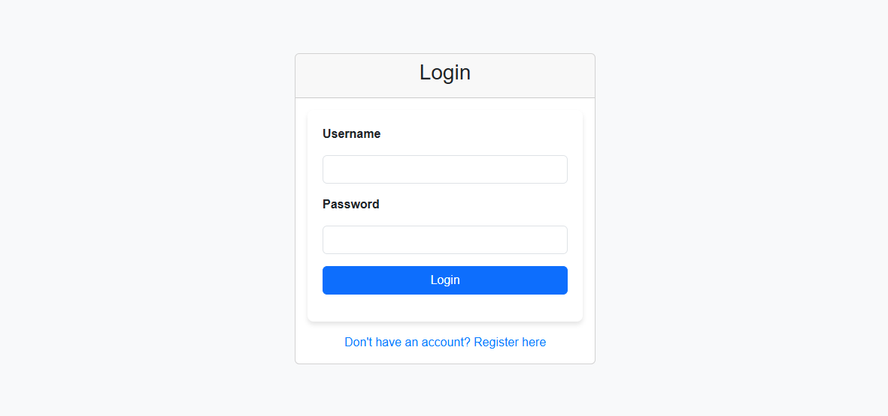
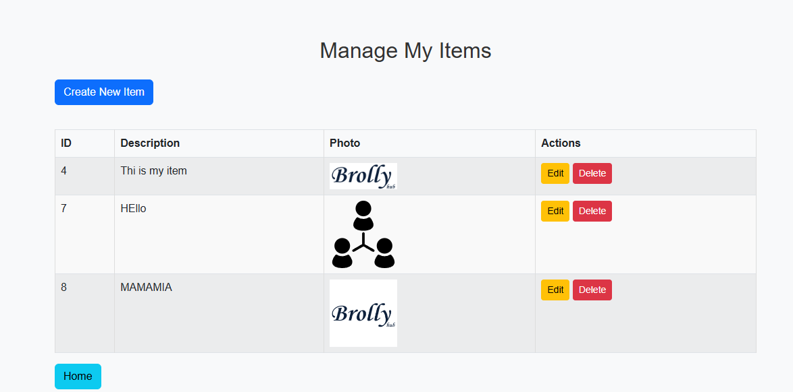
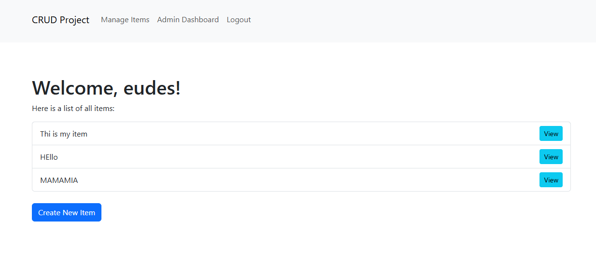
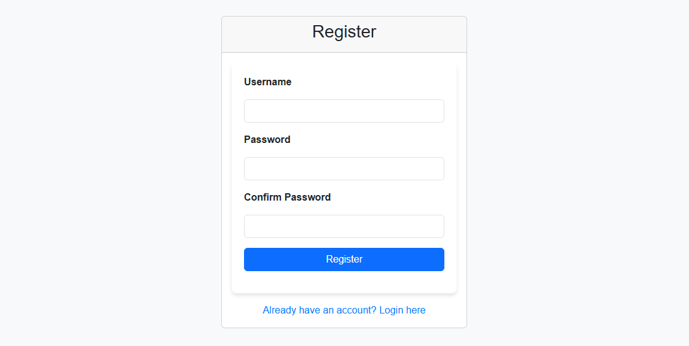
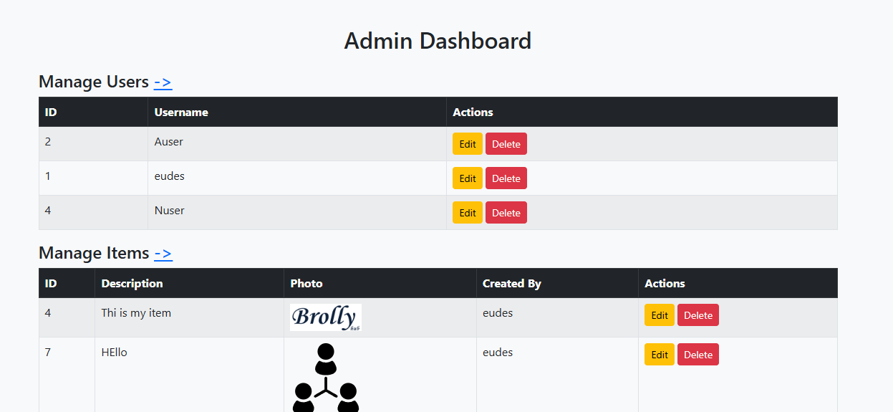

# CRUD Project with PHP & MySQL

A simple web-based CRUD (Create, Read, Update, Delete) application built with plain PHP and MySQL, designed to provide a practical example of database interactions in PHP. The project showcases a basic user management system with login, user roles, and item management functionalities.

## Table of Contents

- [Features](#features)
- [Demo](#demo)
- [Getting Started](#getting-started)
- [Project Structure](#project-structure)
- [Database Structure](#database-structure)
- [Screenshots](#screenshots)
- [Future Improvements](#future-improvements)
- [License](#license)

## Features

1. **User Authentication**: Basic registration, login, and session management.
2. **Role-Based Access Control**:
   - Regular users: Manage their own items.
   - Admins: Manage all users and items.
3. **CRUD Functionalities**:
   - Users can create, view, update, and delete their own items.
   - Admins can manage all users and items in the system.
4. **AJAX-powered Deletion**: Items can be deleted via an AJAX call for a smoother user experience.
5. **Responsive Interface**: Built with Bootstrap for an adaptable layout across various devices.

## Demo

You can view a live demo [here](#). _(Update link once deployed, or remove if not applicable.)_

## Getting Started

### Prerequisites

- XAMPP or similar local server with PHP and MySQL.
- Git (optional for cloning).

### Installation

1. **Clone the Repository**

   ```bash
   git clone https://github.com/JeanEudes-dev/PHP_Simple_crud_project.git
   cd PHP_Simple_crud_project
   ```

2. **Setup Database**

   - Open [phpMyAdmin](http://localhost/phpmyadmin) (or any MySQL client).
   - Create a database named `crud_project` (or another name and update the config).
   - Import the `crud_project.sql` file provided in the root directory.

3. **Configure Database Connection**

   - Update the `db_connect.php` file with your database details.

     ```php
     <?php
     $servername = "localhost";
     $username = "root";
     $password = "";
     $dbname = "crud_project";

     $conn = new mysqli($servername, $username, $password, $dbname);

     if ($conn->connect_error) {
         die("Connection failed: " . $conn->connect_error);
     }
     ?>
     ```

4. **Run the Application**
   - Start your server (Apache & MySQL in XAMPP).
   - Access the application by navigating to `http://localhost/crud_project` in your browser.

## Project Structure

```plaintext
|-- project_root/
    |-- db_connect.php          # Database connection
    |-- login.php               # User login
    |-- register.php            # User registration
    |-- manage_users.php        # Admin-only user management
    |-- manage_items.php        # User item management page
    |-- manage_all_items.php    # Admin-only item management
    |-- create_user.php         # User creation form
    |-- create_item.php         # Item creation form
    |-- edit_user.php           # User editing form
    |-- edit_item.php           # Item editing form
    |-- delete_user.php         # User deletion script
    |-- delete_item.php         # Item deletion script
    |-- logout.php              # Ends user session
    |-- README.md               # Project documentation
```

### Database Structure

#### `Users` Table

| Column     | Type         | Description              |
| ---------- | ------------ | ------------------------ |
| id         | INT, PK      | Unique user ID           |
| username   | VARCHAR(50)  | Username                 |
| password   | VARCHAR(255) | Hashed password          |
| user_level | VARCHAR(10)  | Role (`user` or `admin`) |

#### `Items` Table

| Column      | Type         | Description                   |
| ----------- | ------------ | ----------------------------- |
| id          | INT, PK      | Unique item ID                |
| description | TEXT         | Item description              |
| photo       | VARCHAR(255) | Filepath to item photo        |
| created_by  | INT, FK      | ID of the user who created it |

## Screenshots

1. **Login Page**  
   

2. **Manage Users (Admin)**  
   

3. **Manage Items**  
   

4. **Home Page**
   

5. **Registration**
   

6. **admin_dashboard**
   

## Future Improvements

- **Password Reset**: Provide a way for users to reset forgotten passwords.
- **Pagination**: Improve user and item lists by paginating the display.
- **Search and Filter**: Allow users and admins to filter items by category or keywords.
- **Profile Management**: Enable users to manage their profile settings.


## License

This project is licensed under the MIT License. See the [LICENSE](LICENSE) file for details.

---
